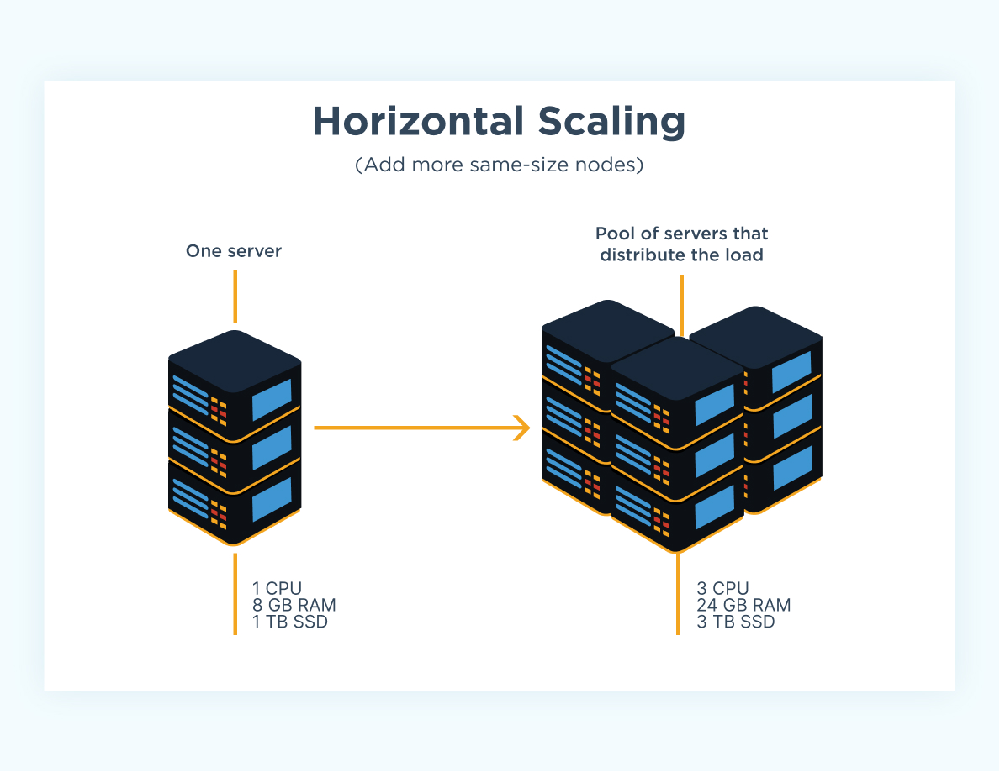
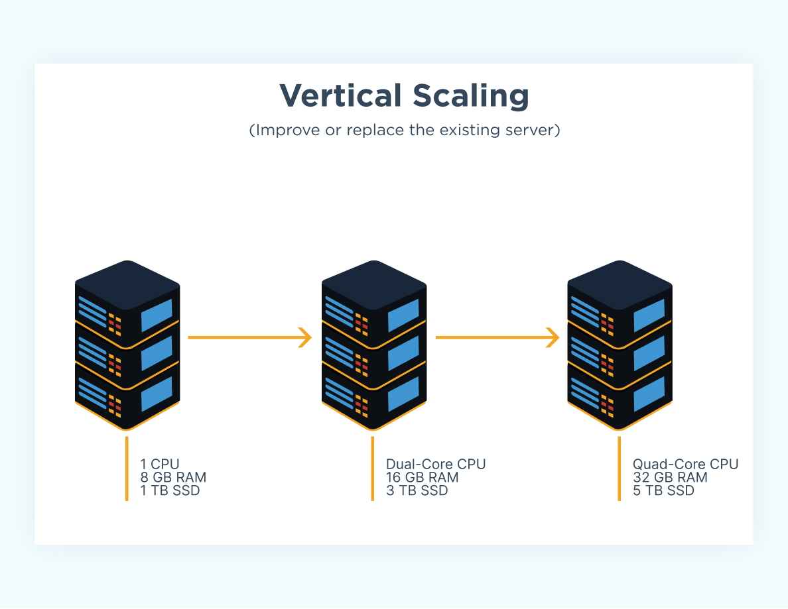
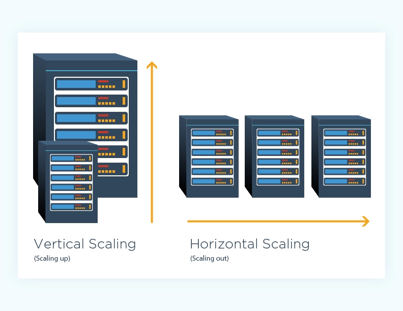

**Why BigData?**

   We can't process huge amount of data classified under above 4V'S(Volume, Velocity, Variety and Veracity) in traditional systems
   To process the data first we need to find a way to store them.
   Where do we store such huge amount of data?
       Can we store and process 1 TB of data if I have storage capacity of 500 GB in single machine? No
       But same 1 TB of data can be stored on 10 machines(100 GB each) and process subsequently. This is nothing but distributed system.

       Before Big Data Era -  It is storage and just process in a single machine/server
       After Big Data Era  -  It is distributed storage and distributed processing in cluster(group of machine)
       
   Traditional way of scaling is vertical scaling. Eg: Any Relational Database
   
   For the distributed storage and processing - horizontal scaling(True scaling)
   
   In horizontal scaling, the number of resources increased directly result in increasing the performance.

**Big Data Requirements:**

Store --> Process -> Scale
Store -  store massive amount of data
Process - Process it in a timely manner
Scale - Scale easily as data grows

**Scalability:**
Two ways to build a system 
Monolithic - A powerful system with lot of resources
Distributed - Many smaller systems(nodes) comes together 
                      Each system is node and together is cluster

Monolithic:
 A single powerful server
Hard to add resources after a certain limit

Resources means - 
RAM - 8 GB(Memory)
Hard Disk - 1 TB(Storage)
CPU Quad core (Compute)

Monolithic Architecture -  Vertical Scaling(No True Scaling)
Distributed Architecture - Horizontal Scaling(True scaling)

## What is Scalability?

Scalability describes a system’s elasticity. While we often use it to refer to a system’s ability to grow, it is not exclusive to this definition. We can scale down, scale up, and scale out accordingly.

If you are running a website, web service, or application, its success hinges on the amount of network traffic it receives. It is common to underestimate just how much traffic your system will incur, especially in the early stages. This could result in a crashed server and/or a decline in your service quality.

Thus, scalability describes your system’s ability to adapt to change and demand. Good scalability protects you from future downtime and ensures the quality of your service.

But what options do you have when it comes to implementing scaling and ensuring your business’s scalability? That’s where horizontal and vertical scaling come in.

### Horizontal Scaling
Horizontal scaling (aka scaling out) refers to adding additional nodes or machines to your infrastructure to cope with new demands. If you are hosting an application on a server and find that it no longer has the capacity or capabilities to handle traffic, adding a server may be your solution.

It is quite similar to delegating workload among several employees instead of one. However, the downside of this may be the added complexity of your operation. You must decide which machine does what and how your new machines work with your old machines.
(<b>Scale in/out</b>)

### Vertical Scaling
Vertical scaling (aka scaling up) describes adding additional resources to a system so that it meets demand. How is this different from horizontal scaling?

While horizontal scaling refers to adding additional nodes, vertical scaling describes adding more power to your current machines. For instance, if your server requires more processing power, vertical scaling would mean upgrading the CPUs. You can also vertically scale the memory, storage, or network speed.

Additionally, vertical scaling may also describe replacing a server entirely or moving a server’s workload to an upgraded one.
(<b>Scale up/down</b>)

Check this [Article]('https://www.datacrafts.club/post/big-data-processing-approaches-monolithic-vs-distributed')