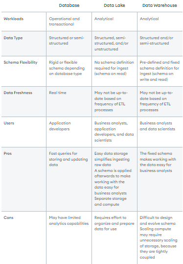

Perhaps you've heard the terms "database," "data warehouse," and "data lake," and you've got some questions. Are these different words to describe the same thing? If not, what are the differences? And when should you choose one over the other?

## What is a database?
A database is a collection of data or information. Databases are typically accessed electronically and are used to support Online Transaction Processing (OLTP). Database Management Systems (DBMS) store data in the database and enable users and applications to interact with the data. The term “database” is commonly used to reference both the database itself as well as the DBMS.

### Database characteristics
A variety of database types have emerged over the last several decades. All databases store information, but each database will have its own characteristics. Relational databases store data in tables with fixed rows and columns. Non-relational databases (also known as NoSQL databases) store data in a variety of models including JSON (JavaScript Object Notation), BSON (Binary JSON), key-value pairs, tables with rows and dynamic columns, and nodes and edges. Databases store structured and/or semi-structured data, depending on the type.

You may also find database characteristics like:
    Security features to ensure the data can only be accessed by authorized users.
    ACID (Atomicity, Consistency, Isolation, Durability) transactions to ensure data integrity.
    Query languages and APIs to easily interact with the data in the database.
    Indexes to optimize query performance.
    Full-text search.
    Optimizations for mobile devices.
    Flexible deployment topologies to isolate workloads (e.g., analytics workloads) to a specific set of resources.
    On-premises, private cloud, public cloud, hybrid cloud, and/or multi-cloud hosting options.

### Why use a database?
If your application needs to store data (and nearly every interactive application does), your application needs a database. Applications across industries and use cases are built on databases. Many types of data can be stored in databases, including:
    Patient medical records
    Items in an online store
    Financial records
    Articles and blog entries
    Sports scores and statistics
    Online gaming information
    Student grades and scores
    IoT device readings
    Mobile application information
    Database examples

A myriad of databases exist. Examples include:
    Relational databases: Oracle, MySQL, Microsoft SQL Server, and PostgreSQL
    Document databases: MongoDB and CouchDB
    Key-value databases: Redis and DynamoDB
    Wide-column stores: Cassandra and HBase
    Graph databases: Neo4j and Amazon Neptune

## OLAP + data warehouses and data lakes
Both data warehouses and data lakes are meant to support Online Analytical Processing (OLAP). OLAP systems are typically used to collect data from a variety of sources. The data is then used to power a range of analytical use cases ranging from business intelligence and reporting (e.g., quarterly sales reports by store) to forecasting (e.g., predicting home sales for the next six months based on historical trends).

With that in mind, let’s compare these two approaches to OLAP.

## What is a data warehouse?
A data warehouse is a system that stores highly structured information from various sources. Data warehouses typically store current and historical data from one or more systems. The goal of using a data warehouse is to combine disparate data sources in order to analyze the data, look for insights, and create business intelligence (BI) in the form of reports and dashboards.

You might be wondering, "Is a data warehouse a database?" Yes, a data warehouse is a giant database that is optimized for analytics.

### Data warehouse characteristics
Data warehouses store large amounts of current and historical data from various sources. They contain a range of data, from raw ingested data to highly curated, cleansed, filtered, and aggregated data.

Extract, transform, load (ETL) processes move data from its original source to the data warehouse. The ETL processes move data on a regular schedule (for example, hourly or daily), so data in the data warehouse may not reflect the most up-to-date state of the systems.

Data warehouses typically have a pre-defined and fixed relational schema. Therefore, they work well with structured data. Some data warehouses also support semi-structured data.

Once the data is in the warehouse, business analysts can connect data warehouses with BI tools. These tools allow business analysts and data scientists to explore the data, look for insights, and generate reports for business stakeholders.

### Why use a data warehouse?
Data warehouses are a good option when you need to store large amounts of historical data and/or perform in-depth analysis of your data to generate business intelligence. Due to their highly structured nature, analyzing the data in data warehouses is relatively straightforward and can be performed by business analysts and data scientists.

Note that data warehouses are not intended to satisfy the transaction and concurrency needs of an application. If an organization determines they will benefit from a data warehouse, they will need a separate database or databases to power their daily operations.

Data warehouse examples
Examples of data warehouses include:
    Amazon Redshift.
    Google BigQuery.
    IBM Db2 Warehouse.
    Microsoft Azure Synapse.
    Oracle Autonomous Data Warehouse.
    Snowflake.
    Teradata Vantage.

## What is a data lake?
A data lake is a repository of data from disparate sources that is stored in its original, raw format. Like data warehouses, data lakes store large amounts of current and historical data. What sets data lakes apart is their ability to store data in a variety of formats including JSON, BSON, CSV, TSV, Avro, ORC, and Parquet.

Typically, the primary purpose of a data lake is to analyze the data to gain insights. However, organizations sometimes use data lakes simply for their cheap storage with the idea that the data may be used for analytics in the future.

### Is a data lake a database?
You might be wondering, "Is a data lake a database?" A data lake is a repository for data stored in a variety of ways including databases. With modern tools and technologies, a data lake can also form the storage layer of a database. Tools like Starburst, Presto, Dremio, and Atlas Data Lake can give a database-like view into the data stored in your data lake. In many cases, these tools can power the same analytical workloads as a data warehouse.

### Data lake characteristics
    Data lakes store large amounts of structured, semi-structured, and unstructured data. They can contain everything from relational data to JSON documents to PDFs to audio files.
    Data does not need to be transformed in order to be added to the data lake, which means data can be added (or “ingested”) incredibly efficiently without upfront planning.
    The primary users of a data lake can vary based on the structure of the data. Business analysts will be able to gain insights when the data is more structured. When the data is more unstructured, data analysis will likely require the expertise of developers, data scientists, or data engineers.
    The flexible nature of data lakes enables business analysts and data scientists to look for unexpected patterns and insights. The raw nature of the data combined with its volume allows users to solve problems they may not have been aware of when they initially configured the data lake.
    Data in data lakes can be processed with a variety of OLAP systems and visualized with BI tools.

#### Why use a data lake?
Data lakes are a cost-effective way to store huge amounts of data. Use a data lake when you want to gain insights into your current and historical data in its raw form without having to transform and move it. Data lakes also support machine learning and predictive analytics.

Like data warehouses, data lakes are not intended to satisfy the transaction and concurrency needs of an application.

Data lake examples
Data lakes can provide storage and compute capabilities, either independently or together.

The following are examples of technology that provide flexible and scalable storage for building data lakes:
    AWS S3
    Azure Data Lake Storage Gen2
    Google Cloud Storage

Other technologies enable organizing and querying data in data lakes, including:
    MongoDB Atlas Data Lake.
    AWS Athena.
    Presto.
    Starburst.
    Databricks SQL Analytics.

### What are the key differences between a database, data warehouse, and data lake?
Databases, data warehouses, and data lakes are all used to store data. So what's the difference?

The key differences between a database, a data warehouse, and a data lake are that:
    A database stores the current data required to power an application.
    A data warehouse stores current and historical data from one or more systems in a predefined and fixed schema, which allows business analysts and data scientists to easily analyze the data.
    A data lake stores current and historical data from one or more systems in its raw form, which allows business analysts and data scientists to easily analyze the data.

The table below summarizes similarities and differences between databases, data warehouses, and data lakes.

## Database vs. data warehouse vs. data lake: which is right for me?
Nearly every interactive application will require a database.

When organizations want to analyze their data from multiple sources, they may choose to complement their databases with a data warehouse, a data lake, or both. When determining if a data lake and/or data warehouse is right for your organization, consider the following questions:
    Is my data structured, semi-structured, or unstructured? Data warehouses support structured and semi-structured data whereas data lakes support all three.
    Will my analysis benefit from having a pre-defined, fixed schema? Data warehouses require users to create a pre-defined, fixed schema upfront, which lends itself to more limited (but easier) data analysis. Data lakes allow users to store data in its raw, original format, which makes it easier to store data without having to apply and maintain structure.
    Where is my data currently stored? Data warehouses require you to create ETL processes to move your data into the warehouse. Depending on where the data is stored, a data lake may not require any data to be moved. For example, MongoDB Atlas Data Lake is able to access data stored in an Amazon S3 bucket, which can be quite advantageous for organizations who are already storing their data there.

### Using MongoDB Atlas databases and data lakes
MongoDB Atlas is a fully-managed database-as-a-service that supports creating MongoDB databases with a few clicks. MongoDB databases have flexible schemas that support structured or semi-structured data.

In many cases, the MongoDB data platform provides enough support for analytics that a data warehouse or a data lake is not required. Some of the features that MongoDB provides to support analytics include:
    A powerful aggregation pipeline that allows for data to be aggregated and analyzed in real time.
    Support for analytics nodes that are designated for analytic workloads. This means that running analytics will not impact the performance of an application's critical operational workloads.
    MongoDB Charts, which provides a simple and easy way to create visualizations for data stored in MongoDB Atlas and Atlas Data Lake—no need to use ETLs to move the data to another location.
    The MongoDB BI Connector, which allows you to connect your MongoDB data to BI and analytics platforms for further visualizations and analysis.
    When you need to combine data from multiple sources, Atlas Data Lake is a great option. Atlas Data Lake allows you to combine data from MongoDB Atlas and Amazon S3 and then query it using the MongoDB Query Language (MQL). Data already stored in S3 does not need to be moved. Data can remain in its raw, original format without transformation.

Atlas Data Lake also supports automatic online archival of data from Atlas. This allows you to store archived data at a cheaper rate in fully managed cloud object storage. Federated queries allow you to seamlessly query data in Atlas and your archive as if they were stored in the same location.

#### Summary
Databases, data warehouses, and data lakes each have their own purpose. Nearly every modern application will require a database to store the current application data. Organizations that want to analyze their applications' current and historical data may choose to complement their databases with a data warehouse, a data lake, or both.
Data warehouses and databases both act as data storage and management tools. However, there are a few key differences to acknowledge. First, data warehouses have analytical capabilities. They enable companies to make analytical queries that track and record certain variables for business intelligence. In contrast, a database is a simple collection of data in one place. Databases’ main purpose is to store data securely and allow users to access it easily.

