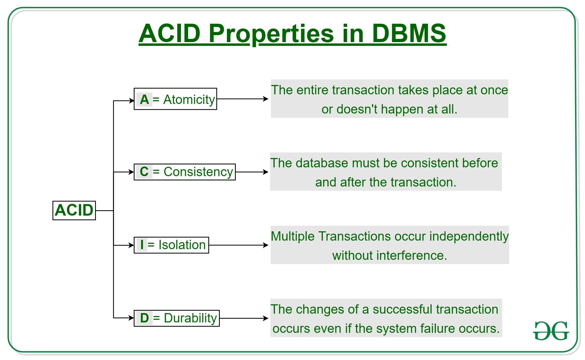
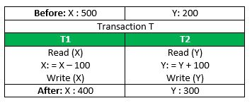
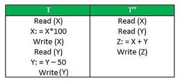

What are the 𝗔𝗖𝗜𝗗 𝗣𝗿𝗼𝗽𝗲𝗿𝘁𝗶𝗲𝘀 𝗼𝗳 𝗗𝗕𝗠𝗦

Transaction is a sequence of steps performed on a database as a single logical unit of work

The ACID database transaction model ensures that a performed transaction is always consistent by ensuring
 
- 𝗔𝘁𝗼𝗺𝗶𝗰𝗶𝘁𝘆 - Each transaction is either properly carried out or the database reverts back to the state before the transaction started
- 𝗖𝗼𝗻𝘀𝗶𝘀𝘁𝗲𝗻𝗰𝘆 - The database must be in a consistent state before and after the transaction
- I𝘀𝗼𝗹𝗮𝘁𝗶𝗼𝗻 - Multiple transactions occur independently without interference
- 𝗗𝘂𝗿𝗮𝗯𝗶𝗹𝗶𝘁𝘆 - Successful transactions are persisted even in the case of system failure

 ACID guarantees will be ensured by the most Relational Databases such as MySQL , PostgreSQL
 
 NoSQL databases do not follow ACID instead BASE transaction model which leads eventual consistency. Eg: Cassandra, MongoDB

A transaction is a single logical unit of work that accesses and possibly modifies the contents of a database. Transactions access data using read and write operations.
In order to maintain consistency in a database, before and after the transaction, certain properties are followed. These are called ACID properties.

### Atomicity:
By this, we mean that either the entire transaction takes place at once or doesn’t happen at all. There is no midway i.e. transactions do not occur partially. Each transaction is considered as one unit and either runs to completion or is not executed at all. It involves the following two operations.
— Abort : If a transaction aborts, changes made to the database are not visible.
— Commit : If a transaction commits, changes made are visible.
Atomicity is also known as the ‘All or nothing rule’.

Consider the following transaction T consisting of T1 and T2 : Transfer of 100 from account X to account Y .

If the transaction fails after completion of T1 but before completion of T2 .( say, after write(X) but before write(Y) ), then the amount has been deducted from X but not added to Y . This results in an inconsistent database state. Therefore, the transaction must be executed in its entirety in order to ensure the correctness of the database state.

### Consistency:
This means that integrity constraints must be maintained so that the database is consistent before and after the transaction. It refers to the correctness of a database. Referring to the example above,
The total amount before and after the transaction must be maintained.
Total before T occurs = 500 + 200 = 700 .
Total after T occurs = 400 + 300 = 700 .
Therefore, the database is consistent . Inconsistency occurs in case T1 completes but T2 fails. As a result, T is incomplete.

### Isolation:
This property ensures that multiple transactions can occur concurrently without leading to the inconsistency of the database state. Transactions occur independently without interference. Changes occurring in a particular transaction will not be visible to any other transaction until that particular change in that transaction is written to memory or has been committed. This property ensures that the execution of transactions concurrently will result in a state that is equivalent to a state achieved these were executed serially in some order.
Let X = 500, Y = 500.
Consider two transactions T and T”.

Suppose T has been executed till Read (Y) and then T’’ starts. As a result, interleaving of operations takes place due to which T’’ reads the correct value of X but the incorrect value of Y and sum computed by
T’’: (X+Y = 50, 000+500=50, 500)
is thus not consistent with the sum at end of the transaction:
T: (X+Y = 50, 000 + 450 = 50, 450) .
This results in database inconsistency, due to a loss of 50 units. Hence, transactions must take place in isolation and changes should be visible only after they have been made to the main memory.

Durability:
This property ensures that once the transaction has completed execution, the updates and modifications to the database are stored in and written to disk and they persist even if a system failure occurs. These updates now become permanent and are stored in non-volatile memory. The effects of the transaction, thus, are never lost.

Some important points:
The ACID properties, in totality, provide a mechanism to ensure the correctness and consistency of a database in a way such that each transaction is a group of operations that acts as a single unit, produces consistent results, acts in isolation from other operations, and updates that it makes are durably stored.

ACID properties are the four key characteristics that define the reliability and consistency of a transaction in a Database Management System (DBMS). The acronym ACID stands for Atomicity, Consistency, Isolation, and Durability. Here is a brief description of each of these properties:

Atomicity: 
Atomicity ensures that a transaction is treated as a single, indivisible unit of work. Either all the operations within the transaction are completed successfully, or none of them are. If any part of the transaction fails, the entire transaction is rolled back to its original state, ensuring data consistency and integrity.
Consistency: 
Consistency ensures that a transaction takes the database from one consistent state to another consistent state. The database is in a consistent state both before and after the transaction is executed. Constraints, such as unique keys and foreign keys, must be maintained to ensure data consistency.
Isolation: 
Isolation ensures that multiple transactions can execute concurrently without interfering with each other. Each transaction must be isolated from other transactions until it is completed. This isolation prevents dirty reads, non-repeatable reads, and phantom reads.
Durability: 
Durability ensures that once a transaction is committed, its changes are permanent and will survive any subsequent system failures. The transaction’s changes are saved to the database permanently, and even if the system crashes, the changes remain intact and can be recovered.
Overall, ACID properties provide a framework for ensuring data consistency, integrity, and reliability in DBMS. They ensure that transactions are executed in a reliable and consistent manner, even in the presence of system failures, network issues, or other problems. These properties make DBMS a reliable and efficient tool for managing data in modern organizations.

#### Advantages of ACID Properties in DBMS:
Data Consistency: ACID properties ensure that the data remains consistent and accurate after any transaction execution.
Data Integrity: ACID properties maintain the integrity of the data by ensuring that any changes to the database are permanent and cannot be lost.
Concurrency Control: ACID properties help to manage multiple transactions occurring concurrently by preventing interference between them.
Recovery: ACID properties ensure that in case of any failure or crash, the system can recover the data up to the point of failure or crash.
#### Disadvantages of ACID Properties in DBMS:
Performance: The ACID properties can cause a performance overhead in the system, as they require additional processing to ensure data consistency and integrity.
Scalability: The ACID properties may cause scalability issues in large distributed systems where multiple transactions occur concurrently.
Complexity: Implementing the ACID properties can increase the complexity of the system and require significant expertise and resources.
Overall, the advantages of ACID properties in DBMS outweigh the disadvantages. They provide a reliable and consistent approach to data
management, ensuring data integrity, accuracy, and reliability. However, in some cases, the overhead of implementing ACID properties can cause performance and scalability issues. Therefore, it’s important to balance the benefits of ACID properties against the specific needs and requirements of the system.