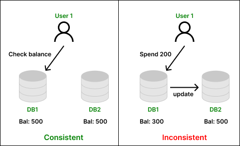
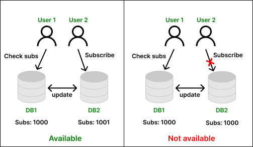
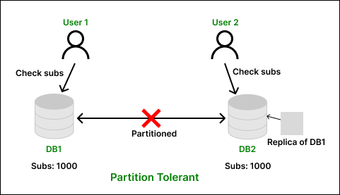
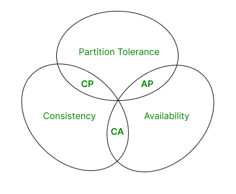
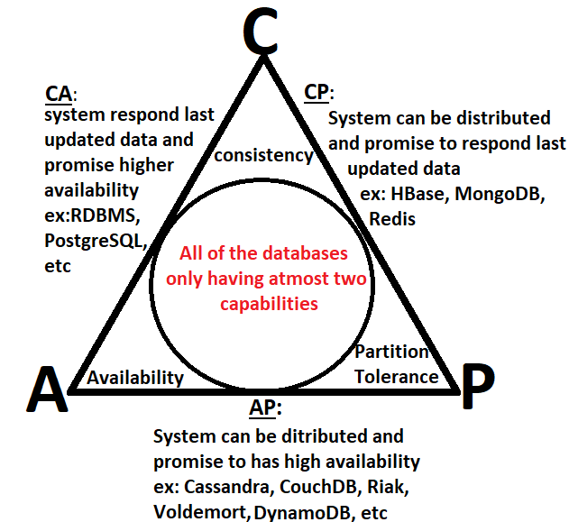

As you progress through your career as a developer, you’ll be required to think more and more about software architecture and system design. It’s important to be able to design efficient systems and make tradeoffs at scale. System design is a vast field that incorporates many important concepts. A fundamental concept within system design is the CAP theorem. Understanding the CAP theorem is key to understanding how to design strong distributed systems.

## What is the CAP theorem?
The CAP theorem says that a distributed system can deliver only two of three desired characteristics: consistency, availability and partition tolerance (the ‘C,’ ‘A’ and ‘P’ in CAP).

Have you ever seen an advertisement for a landscaper, house painter, or some other tradesperson that starts with the headline, “Cheap, Fast, and Good: Pick Two”? The CAP theorem applies a similar type of logic to distributed systems.

## The CAP Theorem in DBMS
The CAP theorem, also known as the CAP principle, can be used to explain some of the competing requirements in a Distributed System with replication. It was created to make system designers aware of the trade-offs while designing networked shared-data systems. In this article, we will discuss the CAP theorem, and the tradeoffs offered by it using various real-life examples. After reading this article, we can ensure you that you can differentiate between each property of the CAP theorem and prioritize them based on your use case.

The three letters in CAP refer to three desirable properties of Distributed Systems with replicated data: Consistency (among replicated copies), Availability (of the system for read and write operations) and Partition Tolerance (of the nodes in the network being partitioned by a network fault). 

What is the CAP Theorem?
The CAP theorem states that it is not possible to guarantee all three of the desirable properties – Consistency, availability, and partition tolerance at the same time in a distributed system with data replication and can only support any two properties at a time. The three properties are as follows: 

Consistency
Consistency means that all the nodes (databases) inside a network will have the same copies of a replicated data item visible for various transactions. It guarantees that every node in a distributed cluster returns the same, most recent and a successful write. It refers to every client having the same view of the data. There are various types of consistency models. Consistency in CAP refers to sequential consistency, a very strong form of consistency. 

Note that the concept of Consistency in ACID and CAP are slightly different since in CAP, it refers to the consistency of the values in different copies of the same data item in a replicated distributed system. In ACID, it refers to the fact that a transaction will not violate the integrity constraints specified on the database schema.

For example, a user checks his account balance and knows that he has 500 rupees. He spends 200 rupees on some product. Hence the amount of 200 must be deducted changing his account balance to 300 rupees. This change must be committed and communicated with all other databases which holds this user’s details. Otherwise, there will be inconsistency, and the other database might show his account balance as 500 rupees which is not true.

Availability
Availability means that each read or write request for a data item will either be processed successfully or will receive a message that the operation cannot be completed. Every non-failing node returns a response for all the read and write requests in a reasonable amount of time. The key word here is “every”. In simple terms, every node (on either side of a network partition) must be able to respond in a reasonable amount of time.

For example, user A is a content creator having 1000 other users subscribed to his channel. Another user B who is far away from user A tries to subscribe to user A’s channel. Since the distance between both users are huge, they are connected to different database node of the social media network. If the distributed system follows the principle of availability, user B must be able to subscribe to user A’s channel.

Partition Tolerance
Partition tolerance means that the system can continue operating even if the network connecting the nodes has a fault that results in two or more partitions, where the nodes in each partition can only communicate among each other. That means, the system continues to function and upholds its consistency guarantees in spite of network partitions. Network partitions are a fact of life. Distributed systems guaranteeing partition tolerance can gracefully recover from partitions once the partition heals. 

For example, take the example of the same social media network where two users are trying to find the subscriber count of a particular channel. Due to some technical fault, there occurs a network outage, the second database connected by user B losses its connection with first database. Hence the subscriber count is shown to the user B with the help of replica of data which was previously stored in database 1 backed up prior to network outage. Hence the distributed system is partition tolerant.

The CAP theorem states that distributed databases can have at most two of the three properties: consistency, availability, and partition tolerance. As a result, database systems prioritize only two properties at a time.

CA (Consistency and Availability)
These types of system always accept the request to view or modify the data sent by the user and they are always responded with data which is consistent among all the database nodes of a big, distributed network.

However, such type of distributed systems is not realizable in real world because when network failure occurs, there are two options: Either send old data which was replicated moments ago before network failure or do not allow user to access the already moments old data. If we choose first option, our system will become Available and if we choose second option our system will become Consistent.

The combination of consistency and availability is not possible in distributed systems and for achieving CA, the system has to be monolithic such that when a user updates the state of the system, all other users accessing it are also notified about the new changes which means that the consistency is maintained. And since it follows monolithic architecture, all users are connected to single system which means it is also available. These types of systems are generally not preferred due to a requirement of distributed computing which can be only done when consistency or availability is sacrificed for partition tolerance.

Example databases: MySQL, PostgreSQL

AP (Availability and Partition Tolerance)
These types of system are distributed in nature, ensuring that the request sent by the user to view or modify the data present in the database nodes are not dropped and are processed in presence of a network partition.

The system prioritizes availability over consistency and can respond with possibly stale data which was replicated from other nodes before the partition was created due to some technical failure. Such design choices are generally used while building social media websites such as Facebook, Instagram, Reddit, etc. and online content websites like YouTube, blog, news, etc. where consistency is usually not required, and a bigger problem arises if the service is unavailable causing corporations to lose money since the users may shift to new platform. The system can be distributed across multiple nodes and is designed to operate reliably even in the face of network partitions.

Example databases: Amazon DynamoDB, Google Cloud Spanner.

CP (Consistency and Partition Tolerance)
These types of system are distributed in nature, ensuring that the request sent by the user to view or modify the data present in the database nodes are dropped instead of responding with inconsistent data in presence of a network partition.

The system prioritizes consistency over availability and does not allow users to read crucial data from the stored replica which was backed up prior to the occurrence of network partition. Consistency is chosen over availability for critical applications where latest data plays an important role such as stock market application, ticket booking application, banking, etc. where problem will arise due to old data present to users of application.

For example, in a train ticket booking application, there is one seat which can be booked. A replica of the database is created, and it is sent to other nodes of the distributed system. A network outage occurs which causes the user connected to the partitioned node to fetch details from this replica. Some user connected to the unpartitioned part of distributed network and already booked the last remaining seat. However, the user connected to partitioned node will still one seat which makes the available data inconsistent. It would have been better if the user was shown error and make the system unavailable for the user and maintain consistency. Hence consistency is chosen in such scenarios.

Example databases: Apache HBase, MongoDB, Redis.

Conclusion
We have seen what CAP theorem is, and why only two of the three properties of the distributed system can be implemented simultaneously by looking at real world examples. We also saw that Consistency and Availability are not chosen simultaneously. Instead, it is usually Consistency or Availability along with partition tolerance which is chosen according to the type of application. Also, it is important to note that the database systems mentioned as examples below CA, CP and AP has configurations and settings that can change their behavior with respect to consistency, availability, and partition tolerance. Therefore, the exact behavior of a database system may depend on its configuration and usage.

Can We overcome the limits proposed by CAP theorem?
Since the CAP theorem suggests that we can only choose any two out of three properties, mainly developers have to choose between Consistency and Availability while ensuring that the system is partition tolerant. Developers may use a hybrid approach, by choosing consistency on some critical parts of application and availability to other less critical parts of application.

What is the difference between Strong Consistency and Eventual Consistency?
Strong Consistency means that when a request is sent to the distributed system to read a data entry from the database, it must respond with the latest write which was performed on the particular entry. All the nodes within the distributed network must be highly synchronized. However, Eventual Consistency do not impose such strict restrictions and states that the entire network will eventually be consistent, and it may respond old data when requested immediately after a write operation was performed on it.

What is quorum-based system?
Quorum-based system is a type of distributed system which uses a voting mechanism to ensure data consistency and availability. A minimum number of nodes must agree on a read or write operation for it to be considered successful. These nodes are called as Quorum. These types of systems can balance the trade-offs between consistency and availability by adjusting the size of the read and write quorums.