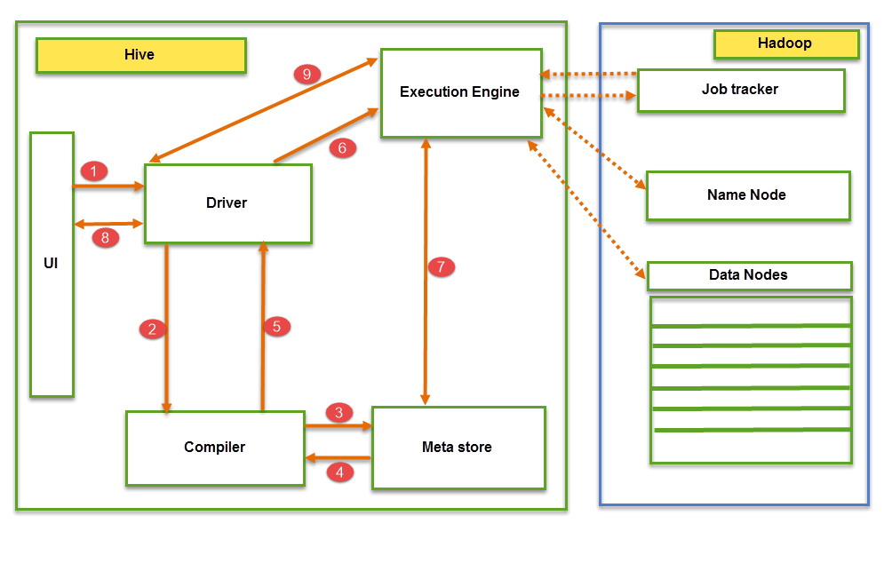

## What is Hive?
Hive is an ETL and Data warehousing tool developed on top of Hadoop Distributed File System (HDFS). Hive makes job easy for performing operations like:
    Data encapsulation
    Ad-hoc queries
    Analysis of huge datasets

### Important characteristics of Hive
In Hive, tables and databases are created first and then data is loaded into these tables.
Hive as data warehouse designed for managing and querying only structured data that is stored in tables.
While dealing with structured data, Map Reduce doesn’t have optimization and usability features like UDFs but Hive framework does. Query optimization refers to an effective way of query execution in terms of performance.
Hive’s SQL-inspired language separates the user from the complexity of Map Reduce programming. It reuses familiar concepts from the relational database world, such as tables, rows, columns and schema, etc. for ease of learning.
Hadoop’s programming works on flat files. So, Hive can use directory structures to “partition” data to improve performance on certain queries.
A new and important component of Hive i.e. Metastore used for storing schema information. This Metastore typically resides in a relational database. We can interact with Hive using methods like
    Web GUI
    Java Database Connectivity (JDBC) interface
Most interactions tend to take place over a command line interface (CLI). Hive provides a CLI to write Hive queries using Hive Query Language(HQL)
Generally, HQL syntax is similar to the SQL syntax that most data analysts are familiar with. The Sample query below display all the records present in mentioned table name.

Sample query : ```Select * from <TableName>```
Hive supports four file formats those are TEXTFILE, SEQUENCEFILE, ORC and RCFILE (Record Columnar File).
For single user metadata storage, Hive uses derby database and for multiple user Metadata or shared Metadata case Hive uses MYSQL.

### Hive Vs Relational Databases
By using Hive, we can perform some peculiar functionality that is not achieved in Relational Databases. For a huge amount of data that is in peta-bytes, querying it and getting results in seconds is important. And Hive does this quite efficiently, it processes the queries fast and produce results in second’s time.

Let see now what makes Hive so fast.

Some key differences between Hive and relational databases are the following;

Relational databases are of “Schema on READ and Schema on Write“. First creating a table then inserting data into the particular table. On relational database tables, functions like Insertions, Updates, and Modifications can be performed.

Hive is “Schema on READ only“. So, functions like the update, modifications, etc. don’t work with this. Because the Hive query in a typical cluster runs on multiple Data Nodes. So it is not possible to update and modify data across multiple nodes.( Hive versions below 0.13)

Also, Hive supports “READ Many WRITE Once” pattern. Which means that after inserting table we can update the table in the latest Hive versions.

NOTE: However the new version of Hive comes with updated features. Hive versions ( Hive 0.14) comes up with Update and Delete options as new features


The above screenshot explains the Apache Hive architecture in detail

Hive Consists of Mainly 3 core parts

Hive Clients
Hive Services
Hive Storage and Computing
Hive Clients:

Hive provides different drivers for communication with a different type of applications. For Thrift based applications, it will provide Thrift client for communication.

For Java related applications, it provides JDBC Drivers. Other than any type of applications provided ODBC drivers. These Clients and drivers in turn again communicate with Hive server in the Hive services.

Hive Services:

Client interactions with Hive can be performed through Hive Services. If the client wants to perform any query related operations in Hive, it has to communicate through Hive Services.

CLI is the command line interface acts as Hive service for DDL (Data definition Language) operations. All drivers communicate with Hive server and to the main driver in Hive services as shown in above architecture diagram.

Driver present in the Hive services represents the main driver, and it communicates all type of JDBC, ODBC, and other client specific applications. Driver will process those requests from different applications to meta store and field systems for further processing.

Hive Storage and Computing:

Hive services such as Meta store, File system, and Job Client in turn communicates with Hive storage and performs the following actions

Metadata information of tables created in Hive is stored in Hive “Meta storage database”.
Query results and data loaded in the tables are going to be stored in Hadoop cluster on HDFS.
Job exectution flow:



From the above screenshot we can understand the Job execution flow in Hive with Hadoop

The data flow in Hive behaves in the following pattern;

Executing Query from the UI( User Interface)
The driver is interacting with Compiler for getting the plan. (Here plan refers to query execution) process and its related metadata information gathering
The compiler creates the plan for a job to be executed. Compiler communicating with Meta store for getting metadata request
Meta store sends metadata information back to compiler
Compiler communicating with Driver with the proposed plan to execute the query
Driver Sending execution plans to Execution engine
Execution Engine (EE) acts as a bridge between Hive and Hadoop to process the query. For DFS operations.
EE should first contacts Name Node and then to Data nodes to get the values stored in tables.
EE is going to fetch desired records from Data Nodes. The actual data of tables resides in data node only. While from Name Node it only fetches the metadata information for the query.
It collects actual data from data nodes related to mentioned query
Execution Engine (EE) communicates bi-directionally with Meta store present in Hive to perform DDL (Data Definition Language) operations. Here DDL operations like CREATE, DROP and ALTERING tables and databases are done. Meta store will store information about database name, table names and column names only. It will fetch data related to query mentioned.
Execution Engine (EE) in turn communicates with Hadoop daemons such as Name node, Data nodes, and job tracker to execute the query on top of Hadoop file system
Fetching results from driver
Sending results to Execution engine. Once the results fetched from data nodes to the EE, it will send results back to driver and to UI ( front end)
Hive Continuously in contact with Hadoop file system and its daemons via Execution engine. The dotted arrow in the Job flow diagram shows the Execution engine communication with Hadoop daemons.

Different modes of Hive
Hive can operate in two modes depending on the size of data nodes in Hadoop.

These modes are,

Local mode
Map reduce mode
When to use Local mode:

If the Hadoop installed under pseudo mode with having one data node we use Hive in this mode
If the data size is smaller in term of limited to single local machine, we can use this mode
Processing will be very fast on smaller data sets present in the local machine
When to use Map reduce mode:

If Hadoop is having multiple data nodes and data is distributed across different node we use Hive in this mode
It will perform on large amount of data sets and query going to execute in parallel way
Processing of large data sets with better performance can be achieved through this mode
In Hive, we can set this property to mention which mode Hive can work? By default, it works on Map Reduce mode and for local mode you can have the following setting.

Hive to work in local mode set

SET mapred.job.tracker=local;

#### Summary
Hive is an ETL and data warehouse tool on top of Hadoop ecosystem and used for processing structured and semi structured data.

Hive is a database present in Hadoop ecosystem performs DDL and DML operations, and it provides flexible query language such as HQL for better querying and processing of data.
It provides so many features compared to RDMS which has certain limitations.
For user specific logic to meet client requirements.

It provides option of writing and deploying custom defined scripts and User defined functions.
In addition, it provides partitions and buckets for storage specific logics.