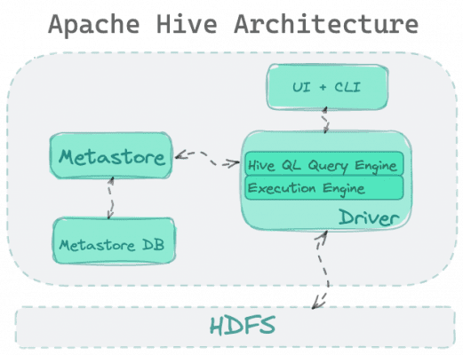

- The Metastore is the system catalog which contains metadata about the tables stored in Hive. 

- Holds table / namespace definitions (column types, physical layout)

- Holds partitioning information

- Can be stored in Derby, MySQL, and many other relational databases

## What is Hive Metastore?
Hive Metastore (HMS) provides a single repository of metadata that you can quickly analyze to make educated, data-driven decisions. It’s an important component of many data lake systems. Hive is based on Apache Hadoop and can store data on S3, ADLS, and other cloud storage services via HDFS. Hive enables users to access, write, and manage petabytes of data with SQL.

The primary components of Hive Metastore are as follows:

UI – The user interface via which users submit queries and do other system tasks. As of 2011, the system featured a command-line interface, and a web-based GUI was under development.
Driver – The component that accepts queries. This component implements session handles and offers execute and fetch APIs based on JDBC/ODBC interfaces.
Compiler – The component that parses the query, performs semantic analysis on the various query blocks and query expressions, and provides an execution plan using table and partition metadata obtained from the metastore.
Metastore – The component that holds all of the structural information for the warehouse’s multiple tables and partitions, including column and column type information, serializers and deserializers used to read and write data, and the related HDFS files where the data is kept.
Execution Engine – The component that performs the execution plan generated by the compiler. The plan is organized as a DAG of steps. The execution engine handles the dependencies between the various phases of the plan and runs them on the relevant system components.

What Hive Metastore (HMS) Does
When new data is saved to object storage, we register it into Hive Metastore by calling the metastore API from the code of any data application or orchestration tool. This declarative phase maps a set of objects in the object store to a table exposed by Hive. Part of registration includes specifying the schema of the table held in the file system, with some metadata describing the columns.

Using Hive Metastore in this way provides four main benefits related to:

Virtualization

Discoverability

Schema Evolution

Performance

Let’s discuss these in more detail!

Virtualization
Data analysts using SQL usually aren’t interested in the details of object storage and its access patterns. They’d simply like to have their tables, please!

This dynamic is the driving force that makes Hive Metastore irreplaceable while other Hadoop components were replaced. Every new technology that was introduced made sure to support Hive Metastore to avoid breaking critical analytic workflows dependent upon the table objects defined in Hive.

Discoverability
Hive Metastore naturally becomes a catalog of all the collections held in object storage when exposing new data is accompanied by updating it. If well maintained, this allows for the discovery of data sets available to query.

Additionally, supplemental can be saved in the metastore to provide helpful information about the data like its update frequency, who owns it, etc.

Schema Evolution
One of the challenges of managing data sets over time is their mutability. Records may change over time with respect to the existing columns describing their attributes. Or the set of attributes itself changes over time, resulting in a change to the schema of the table. 

The registration process described above provides a record of the schema for each additional data file that belongs to the table. This means that if the schema has changed at some point in time, it will be recorded within the Hive Metastore. When accessing the data, it can be accessed with the appropriate schema. 

This also provides a good basis to validate a schema if it should not have changed, and alert users to it. Hive holds the information to create such a test.

Performance
Since Hive Metastore maps the table to the underlying object, it allows the representation of a relational database as partitions according to the primary key supported by the object storage. The granularity of the partitions can be set by the user, and if partitions are balanced and their number is reasonable, this mapping allows improvement in query performance.

This is often referred to as “partition pruning”, which allows a query engine to identify data files that can be skipped.